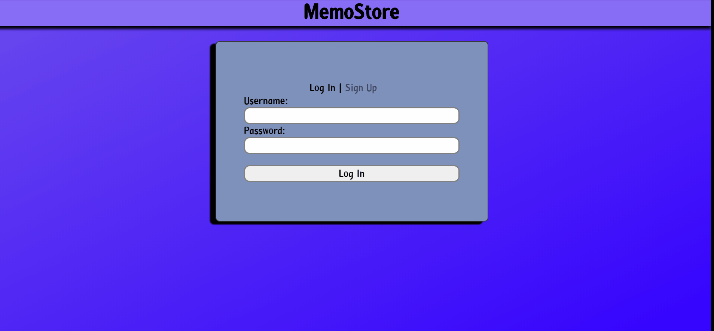

This project was bootstrapped with [Create React App](https://github.com/facebook/create-react-app).

This repo is for the frontend to my MemoStore app! As mentioned above, it's built using React. The main functionality of the app is to allow users to sign up and log in to accounts that contain a memo they typed in. The main page is built off of the `<Login/>` component which contains a login or signup form (depending on a flag). Once a user submits the form, the app uses `react-router-dom` to transition them to the `<MemoDisplay/>` component. `<MemoDisplay/>` displays the memo stored on my local MongoDB server, if the user is properly logged in, and an error message otherwise.

